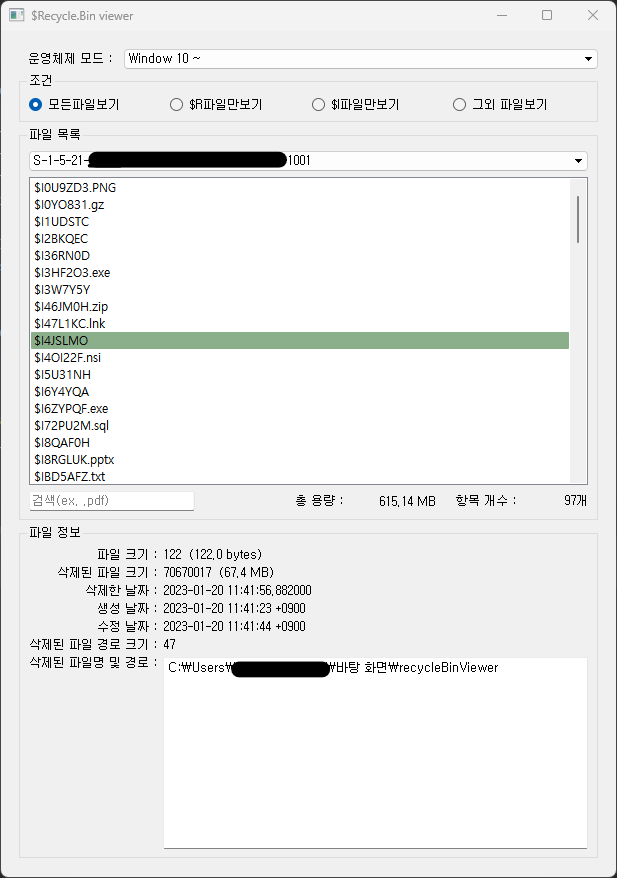

# Recyclebin-Forensic-Viewer
Windows Artifact Viewer for Recyclebin Forensic. (Windows Vista~ / Windows 10)  

# $Recycle.bin viewer

WINS Project – 윈도우 아티팩트 뷰어 제작 팀에서 제작한 $Recycle.bin 파일 구조와 정보를 파악할 수 있는 뷰어입니다. 

휴지통 관련 포렌식 도구로 사용 가능합니다. 

### 설치 전 주의 사항
    
    이 프로그램은 Windows Vista 버전 이 후부터 사용가능합니다.
    
    (휴지통 파일 이름이 $Recycle.bin 인 경우)
    
### 설치 방법

https://www.dropbox.com/scl/fo/j1ux9rdxvbea2kl3gnjfg/h?dl=0&rlkey=wwh5hzeok23a12r91mmnr86rq
    
  > 위 Dropbox 링크에서 zip 파일 다운로드 >> 압축 풀기 >> 설치 진행
    
    * ! 설치 진행 중 윈도우 디펜더 보안 경고가 나올 시에 무시하고 진행합니다. !
    
    * 몇몇 환경에서 pyinstaller로 패키징한 파일을 trojan으로 오탐하는 경우가 있습니다.
    
       해당 프로그램은 pyinstaller로 패키징한 py 파일입니다.
    
### 사용 방법 및 기능
**사용 방법**

 1. 처음 실행 시에 나오는 경로 입력 창에 분석할 $Recycle.bin 파일까지의 경로를 입력합니다.

        
  > 주의
        
        - $Recycle.bin 파일까지의 경로를 입력해야 하며, 경로 마지막 글자는 ‘\’로 끝나야 합니다. 
          (혹은 $I 파일 또는 $R 파일이 담긴 폴더) ex. C:\$Recycle.bin\
        
        - 해당 프로그램은 사용자가 정상적으로 경로를 입력했다는 가정하에 동작합니다.
        
        - 경로를 제대로 입력하지 않을 경우, 프로그램이 자동으로 꺼질 수 있습니다. 
          당황하지 말고 프로그램을 재실행한 후, 경로를 다시 입력하면 됩니다.
       

2. 윈도우 운영체제 모드를 선택합니다.
    

    
# 

**기능**

<조건>

    - 조건 그룹에서 리스트에 출력할 파일 조건을 선택할 수 있습니다.

<파일 목록>
    
    - 파일 목록 그룹에서 SID 리스트를 확인할 수 있습니다.
    
    - SID를 선택하면 그 SID 안에 있는 $I, $R 파일들을 확인할 수 있습니다.
    
    - ‘모든 파일 보기’ 조건에서, 서로 매칭되는 $I, $R 파일의 경우 하얀색, $I 파일만 있는 경우 파란색으로 표시됩니다. 
      (휴지통 안에서 한번 복구한 파일)
      
    - 목록 내에 매칭되는 $I, $R파일 중 하나를 선택할 경우, 초록색으로 해당 파일과 그의 쌍이 표시됩니다.
    
    - 대소문자를 구분하지 않는 검색 기능을 제공합니다.
    
    - 항목 개수와 해당 SID 폴더의 총 용량을 확인할 수 있습니다.
    
<파일 정보>
    
    - $I만 존재하는 파일의 경우, ($I) 파일 크기, 삭제된 파일 크기, 삭제한 날짜, 삭제된 파일명 및 경로가 표시되며, 
      운영체제 모드에 따라 삭제된 파일 경로 크기까지 표시될 수 있습니다.
      
    - $I와 $R파일 모두 존재하는 파일의 경우, ($I/$R) 파일 크기, 삭제된 파일 크기, 삭제한 날짜, ($R) 생성 날짜, ($R) 수정 날짜, 
      삭제된 파일명 및 경로가 표시되며, 운영체제 모드에 따라 삭제된 파일 경로 크기까지 표시될 수 있습니다.
      
    - 그 외의 파일의 경우, 파일 크기, 생성 날짜, 수정 날짜가 표시됩니다.

#

### 오류 제보 / 궁금한 점
    
    발견한 프로그램 오류 또는 궁금점이 있다면 아래 이메일로 연락 바랍니다.
    
    < jieen4523@gmail.com >
    < haedam615@naver.com >
